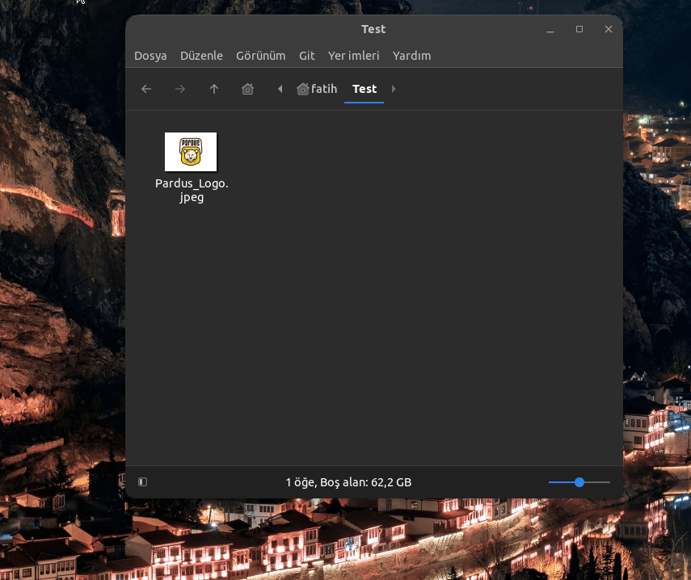

<a href="#">
    
</a>

# IMFOC Nemo extension
This plugin allows easy format conversion of image files in Nemo File Manager.

----------------------

# Linux Screenshot
  

----------------------------------
# Installation
Install IMFOC-Nemo Ext.

Linux (based debian) Terminal: Linux (debian based distributions) To install directly from Terminal.
```bash
mkdir -p ~/IMFOC_TEMP && cd ~/IMFOC_TEMP && wget -O IMFOC-NemoExt.zip "https://github.com/cektor/IMFOC/releases/download/1.0.2/IMFOC-NemoExt.zip" && unzip -o IMFOC-NemoExt.zip && cd IMFOC-NemoExt && sudo chmod +x install.sh && bash install.sh && cd ~ && rm -rf ~/IMFOC_TEMP

```
----------------------

# Installing Nemo File Manager Full
To Install Nemo File Manager with All the Commitment and Necessary Tools (Not:If Nemo is installed on your system and is not required, do not install it.)
```bash
sudo apt install -y nemo nemo-fileroller nemo-preview nemo-media-columns nemo-image-converter nemo-share
```

----------------------------------
