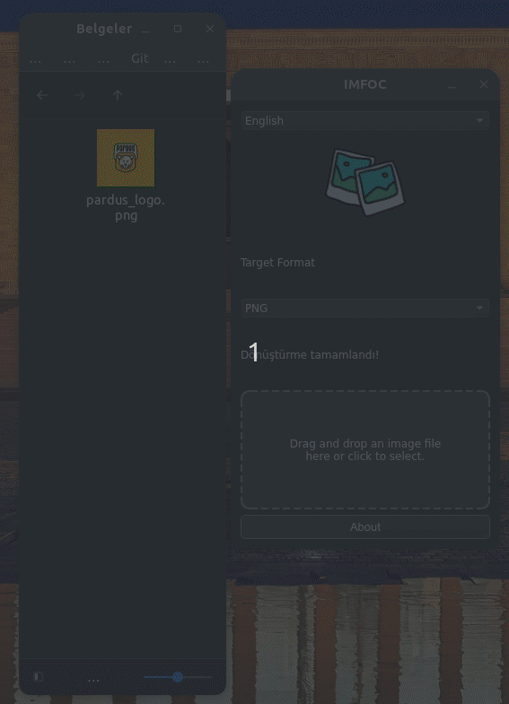

<a href="#">
    
</a>

# IMFOC
This application allows users to easily convert image files into different formats. It offers a user-friendly experience with its drag-and-drop feature; you can select an image file by dragging it into the app or clicking on the tag field.It has the ability to delete Background from formats such as PNG (BETA) Cross Platform Supports

<h1 align="center">IMFOC Logo</h1>

<p align="center">
  
</p>


----------------------

# Linux Screenshot
  

# Windows Screenshot
 

--------------------
Install Git Clone and Python3

Github Package Must Be Installed On Your Device..

git
```bash
sudo apt install git -y
```

Python3
```bash
sudo apt install python3 -y 

```

pip
```bash
sudo apt install python3-pip

```

# Required Libraries

PyQt5
```bash
pip install PyQt5
```
PyQt5-sip
```bash
pip install PyQt5 PyQt5-sip
```

PyQt5-tools
```bash
pip install PyQt5-tools
```

Required Libraries for Debian/Ubuntu
```bash
sudo apt-get install python3-pyqt5
sudo apt-get install qttools5-dev-tools
```

Pillow
```bash
pip install python3-pillow

```


----------------------------------


# Installation
Install IMFOC

```bash
sudo git clone https://github.com/cektor/IMFOC.git
```
```bash
cd IMFOC
```

```bash
python3 imfoc.py

```

# To compile

NOTE: For Compilation Process pyinstaller must be installed. To Install If Not Installed.

pip install pyinstaller 

Linux Terminal 
```bash
pytohn3 -m pyinstaller --onefile --windowed imfoc.py
```

Windows VSCode Terminal 
```bash
pyinstaller --onefile --noconsole imfoc.py
```

MacOS VSCode Terminal 
```bash
pyinstaller --onefile --noconsole imfoc.py
```

# To install directly on Windows or Linux


Linux (based debian) Terminal: Linux (debian based distributions) To install directly from Terminal.
```bash
wget -O Setup_Linux64.deb https://github.com/cektor/IMFOC/releases/download/1.0.2/Setup_Linux64.deb && sudo apt install ./Setup_Linux64.deb && sudo apt-get install -f -y
```

Windows Installer CMD (PowerShell): To Install from Windows CMD with Direct Connection.
```bash
powershell -Command "Invoke-WebRequest -Uri 'https://github.com/cektor/IMFOC/releases/download/1.00/Setup_Win64.exe' -OutFile 'Setup_Win64.exe'" && start /wait Setup_Win64.exe
```

Release Page: https://github.com/cektor/IMFOC/releases/tag/1.0.2

----------------------------------
